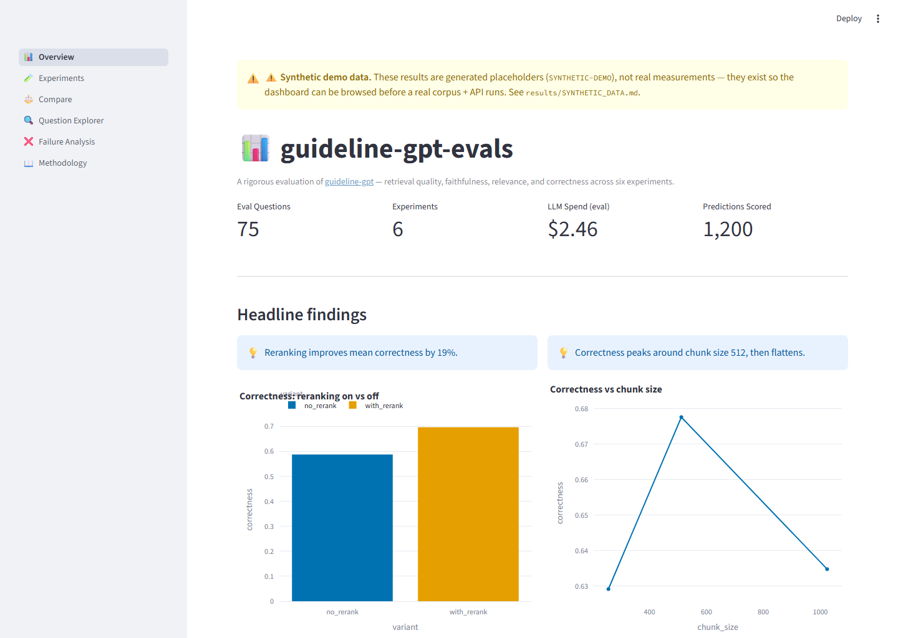

# guideline-gpt-evals

> A rigorous evaluation framework for RAG systems, demonstrated against
> [`guideline-gpt`](https://github.com/joshquigs11093/guideline-gpt).

[](https://github.com/joshquigs11093/guideline-gpt-evals/actions/workflows/ci.yml)
[](pyproject.toml)
[](LICENSE)

This is the companion repository to `guideline-gpt`. It imports `guideline-gpt`
as a dependency, runs systematic experiments against it, and publishes the
results as a **browseable Streamlit dashboard** and a **rendered analysis
notebook** — so anyone can explore the findings without running code or supplying
API keys. The two repos tell a complementary story: *I build* + *I measure*.

> ⚠️ **The committed results are synthetic** (`SYNTHETIC-DEMO`) — generated to
> exercise the harness end-to-end while a real corpus is pending. The framework,
> dashboard, and notebook are real; the numbers are placeholders until
> `eval-harness run` is executed against an ingested corpus. See
> [`results/SYNTHETIC_DATA.md`](results/SYNTHETIC_DATA.md).



## What it measures

Four metric families across six controlled experiments:

- **Retrieval quality** — precision@5, recall@5, MRR, nDCG@5 (deterministic)
- **Faithfulness** — does every claim follow from the retrieved chunks? (LLM judge)
- **Answer relevance** — does the answer address the question? (LLM judge)
- **Correctness** — does the answer match ground truth? (LLM judge)

See [`METHODOLOGY.md`](METHODOLOGY.md) for how, and the
[ADRs](docs/decisions/) for why.

## Quick start — browse the results

No API keys required; the dashboard reads pre-computed results.

```bash
# Option A: Docker (one command)
docker compose up --build           # → http://localhost:8501

# Option B: local
uv venv && uv pip install -e .       # base deps only (no torch)
streamlit run src/eval_harness/ui/dashboard.py
```

The narrative walkthrough is in [`notebooks/analysis.html`](notebooks/analysis.html)
(open in a browser) or via [nbviewer](https://nbviewer.org).

## The dashboard

| Page | What it shows |
|---|---|
| 📊 Overview | Headline stats and three lead findings |
| 🧪 Experiments | Per-variant metrics, difficulty breakdown, cost/latency |
| ⚖️ Compare | Side-by-side variants, per-question scatter, win/loss/tie |
| 🔍 Question Explorer | Filter the eval set; per-question scores + judge rationales |
| ❌ Failure Analysis | Worst-scoring questions, clustered by failure mode |
| 📖 Methodology | The methodology and dataset docs, inline |

## Running experiments yourself

Requires the `experiments` extra (pulls `guideline-gpt`, torch, chromadb) and API
keys:

```bash
uv pip install -e ".[dev,experiments]"
cp .env.example .env                 # add ANTHROPIC_API_KEY + OPENAI_API_KEY
eval-harness validate-dataset
eval-harness run experiments/02_reranker_ablation.yaml
```

## Development

```bash
uv pip install -e ".[dev,experiments]"
ruff check src tests && ruff format --check src tests
mypy src
pytest --cov=eval_harness
```

## Project layout

```
src/eval_harness/
  metrics/      deterministic retrieval metrics
  judges/       LLM-as-judge (faithfulness, relevance, correctness)
  runner/       experiment config, variant builder, runner, scoring
  report/       results store + aggregation
  ui/           Streamlit dashboard
eval_dataset/   the eval set + corpus manifest
experiments/    the six experiment configs
results/        pre-computed (synthetic) results — committed
notebooks/      analysis.ipynb + analysis.html
docs/decisions/ architecture decision records
```

## Documentation

- [`METHODOLOGY.md`](METHODOLOGY.md) — how the evaluation is done and why
- [`DATASET.md`](DATASET.md) — how the eval set is constructed and validated
- [`docs/decisions/`](docs/decisions/) — architecture decision records
- [`.spec/SPEC-guideline-gpt-evals.md`](.spec/SPEC-guideline-gpt-evals.md) — the build spec

## License

[MIT](LICENSE)
